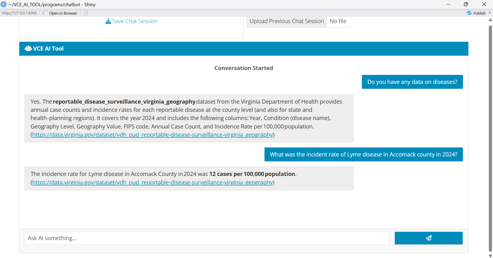

# VCE AI Tool


VCE AI Tool is a Retrieval-Augmented Generation (RAG) chatbot designed to help Virginia Cooperative Extension (VCE) agents quickly access insights and data about communities across the Commonwealth. The motivation of this chatbot is to enable VCE agents to efficiently access complex data and use that information to respond to emerging local needs.

---

## 📝 Description

Standard LLMs frequenty hallucinate and give false answers to the user. VCE AI Tool mitigates these hallucinations by using RAG, which limits the chatbot to only answer based on the datasets it is provided ([Cheng et al., 2025](https://arxiv.org/abs/2503.10677)). In addition, we aim to apply prompt scaffolding frameworks, guardrails to user prompts, to filter out potential noise and improve the accuracy of retrieval ([Quintero, 2025](https://dspace.mit.edu/entities/publication/f748ebfd-082b-48af-8edb-c3959ff1ca85)). In previous literature reviewed, chatbots employing RAG were used to analyze country level data and soley focused on tabular data ([Ali et al., 2025](https://link.springer.com/chapter/10.1007/978-3-032-18487-0_2)). Our chatbot's contribution will be to focusing on the county level of the state of Virginia and also the incorporation of spatial data. 

---

## 📖 User Guide

**Prerequisites:**

Before getting started, make sure that you have completed the following (**note:** for the following instructions, use terminal on macOS/Linux or PowerShell on Windows): 

* **Ollama** – For processing data
  * In your terminal, run “ollama --version” to check if Ollama is installed on your device. If not, install it here: https://ollama.com/download 
  * Once Ollama is installed, run the following command in your terminal to download the required data embedding model:
    ```
    ollama pull nomic-embed-text
    ```
* **Git** – For downloading this project
  * In your terminal, run “git --version” to check if Git is installed on your device. If not, install it here: https://git-scm.com/install/
  * Once Git is installed, run the following command in your terminal to download this project:
    ```
    git clone https://github.com/cjulianan/VCE_AI_TOOL.git
    ```
* **R** – For programming language
  * In your terminal, run “R --version” to check if R is installed on your device. If not, install it here: https://cran.rstudio.com/
* **R Studio** – Interface for running app
  * In your terminal, run “rstudio --version” to check if R Studio is installed on your device. If not, install it here: https://posit.co/downloads
  * Open the project folder “VCE_AI_TOOL” and open the “VCE_AI_TOOL.Rproj” file with R Studio to access the project.
  * Run the following commands in the console to install required packages:
    ```
    # Install standard CRAN packages  
    install.packages(c("bslib", "shiny", "DBI", "duckdb", "jsonlite", "readr", "markdown", "rlang", "here", “dplyr”, "remotes"))  
    
    # Install GitHub packages 
    remotes::install_github("r-lib/ellmer") remotes::install_github("tidyverse/ragnar") 
    ```

 * **VT ARC API Access** – For calling LLM
   * Ensure you have an API key from ARC VT. If not, follow the instructions under the Access section of the following website to generate an API key:   https://www.docs.arc.vt.edu/ai/011_llm_api_arc_vt_edu.html
   * Inside the VCE_AI_TOOL project folder’s root directory, create a file named “.Renviron” and add the following line within it:
     ```
     VT_ARC_API_KEY="your_actual_api_key_here" 
     ```

**Setting Up Chatbot:**
1. Open the project folder “VCE_AI_TOOL” and open the “VCE_AI_TOOL.Rproj” file with R Studio to access the project. 

2. Inside R Studio within the “VCE_AI_TOOL” project, run the script located in programs/chatbot/ called “build_registry_store.R” to embed the metadata the chatbot will rely on (you will only need to do this once). You can run the script by pressing Ctrl + Shift + Enter for windows or Cmd + Shift + Return. 

3. Run the script located in programs/chatbot/ called “chatbot_prototype.R” (this is the script that holds all the chatbot logic). You can run the script by pressing Ctrl + Shift + Enter for windows or Cmd + Shift + Return.This script is to be run every time you wish to open and use the chatbot.  
 1. If you encounter the following error message when running the chatbot script: 
     ```
     Error in ..stacktraceon..({ : The registry store does not exist. Run : Rscript programs/chatbot/build_registry_store.R 
     ```
     Go to the toolbar at the top of RStudio and click Session > Restart R.  
     
     Then, repeat steps 2 and 3 above.

**Querying with Chatbot:**
The chatbot is designed to answer county level questions of Virginia and currently contains information on the broad topics of health, education, and agriculture. The chatbot is designed with a Retrieval-Augmented Generation system, meaning it only answers questions it has datasets on to mitigate hallucinations and fabricated information commonly encountered in conventional chatbots. Thus, if it is asked a question that it doesn’t have dataset information on, it will respond that it cannot answer (more datasets and topics will be added in the future). 

To ask the chatbot a question, input your prompt inside the textbox on the bottom of the chatbot interface and click the button with the paper airplane symbol to send. The chatbot will answer the question and also provide a clickable hyperlink to the source of information if applicable. Chatbot responses will work best when given a specific Virginia county in the user’s prompt.  

Below is an example conversation flow: 



**Chatbot Export Feature:**
There are also two button options on the top of the chatbot designed to allow the user to save and upload their chat sessions locally. Press the button titled “Save Chat Session” to download a copy of your current chat session anywhere on your device. The next time you boot up the chatbot again with a new chat session, you can click the button titled “Upload Previous Chat Session” to view any previous chat sessions you have saved previously. 

---

## 📊 Data Pipeline

**Data Collection:**

Currently, the chatbot contains tabular datasets spanning across the topics of health, education, and agriculture that cover the county level of Virginia. These datasets were either downloaded from online websites or from public APIs. Datasets were also cleaned using R, to ensure consistency (e.g. filtering out unused variables, adding FIPS code variables, and keeping only relevant years).  

**Metadata:**

Each dataset has a corresponding metadata file to provide detailed descriptions of that dataset. The only difference in metadata column format is for American Community Survey (columns has variable codes and human label) and Area Health Resources files (columns has only name and description). 

* **File Paths:** `File Name` • `File Path` • `Raw File Path` • `URL Source`
* **Context:** `Description` • `Organization` • `Geographic Level` • `Time Coverage`
* **Structure:** `Unit of Analysis` • `Primary Keys` • `Join Keys`
* **Processing:** `Cleaning Scripts` • `Spatial Alignments`
* **Columns Schema:** `Variable Name`, `Data Type`, `Keywords`, `Description`, `Missing Values`

In addition to a metadata file for each dataset, a master registry metadata file is used as a comprehensive metadata file for every dataset.

* **Registry Fields:** `Dataset ID` • `Metadata Path` • `Keywords`

**Chatbot Data Retrieval Process:**

All metadata files are embedded through the R package Ragnar, to provide semantic meaning through numerical representation to those files. These embedded metadata are all stored inside a DuckDB registry store file.

When the user asks a prompt, Ragnar ranks the top k relevant metadata and picks the top candidate to use to generate the answer. The metadata contains the path to the dataset, which DuckDB uses to query and retrieve the specific answer.

**Data and Metadata Repository Locations:**

| Location | Content | Notes |
| :--- | :--- | :--- |
| `programs/cleaning/` | Cleaning scripts | |
| `references/codebook/` | Codebooks | Sorted by organization |
| `data/sources/` | Uncleaned datasets | Sorted by organization |
| `data/outcome/` | Cleaned datasets and metadata files | Sorted by organization |
| `data/outcome/` | Master registry & Registry store | Standalone files |

**List of Datasets by Topic:**
<details>
<summary><b>🏥 Health Datasets</b></summary>

* **Area Health Resources Files**
  * **Organization:** Health Resources and Services Administration
  * **Datasets:** Area Health Resources Files (includes health facilities, professions, training programs etc.)
  * **Update Frequency:** Annually
  * **Last Time Updated as of 6/3/2026:** 01/29/2026
  * **URL:** https://data.hrsa.gov/data/download
  * **API Dependencies:** None
  * **Known Limitations:** Metadata file too large. Exceeds model’s maximum context length so will need to add context size check into chatbot code to fix.

* **Virginia Hospitals**
  * **Organization:** Virginia Geographic Information Network
  * **Datasets:** Virginia Hospitals (includes locations of hospitals)
  * **Update Frequency:** Annually
  * **Last Time Updated as of 6/3/2026:** 11/13/2025
  * **URL:** https://vgin.vdem.virginia.gov/datasets/cc17f1dd831d48e98ac6d5a3593a67d4_1/explore?location=37.933550%2C-79.504900%2C6
  * **API Dependencies:** None
  * **Known Limitations:** None

* **Depression Risk**
  * **Organization:** Mental Health America
  * **Datasets:** Number of People at Risk of Depression Per 100K of County Population (includes PTSD and trauma)
  * **Update Frequency:** Annually
  * **Last Time Updated as of 6/3/2026:** 11/13/2025
  * **URL:** https://mhanational.org/data-in-your-community/mha-state-county-data/
  * **API Dependencies:** None
  * **Known Limitations:** None

* **Reportable Disease Surveillance**
  * **Organization:** Virginia Department of Health
  * **Datasets:** Reportable Disease Surveillance Virginia Geography
  * **Update Frequency:** Annually
  * **Last Time Updated as of 6/3/2026:** 2025
  * **URL:** https://data.virginia.gov/dataset/vdh_pud_reportable-disease-surveillance-virginia_geography
  * **API Dependencies:** None
  * **Known Limitations:** None

* **County Health Rankings**
  * **Organization:** County Health Rankings & Roadmaps
  * **Datasets:** 2025 County Health Rankings Virginia Data (including mental health providers, food environment index, air quality etc.)
  * **Update Frequency:** Annual
  * **Last Time Updated as of 6/3/2026:** 2025
  * **URL:** https://www.countyhealthrankings.org/health-data/virginia/data-and-resources
  * **API Dependencies:** None
  * **Known Limitations:** None

</details>

<details>
<summary><b>🎓 Education Datasets</b></summary>

* **CCD Directory**
  * **Organization:** Common Core Dataset (Sourced by Urban Institute)
  * **Datasets:** 2020-2024 CCD Directory (including school levels, type, enrollment etc.)
  * **Update Frequency:** Annually
  * **Last Time Updated as of 6/3/2026:** 2024
  * **URL:** https://github.com/UrbanInstitute/education-data-package-r
  * **API Dependencies:** Education Data Portal from Urban Institute
  * **Known Limitations:** None

* **SOL Test Results**
  * **Organization:** Virginia Department of Education
  * **Datasets:** Standards of Learning Test Results (including state testing pass rates)
  * **Update Frequency:** Annually
  * **Last Time Updated as of 6/3/2026:** 2025
  * **URL:** https://www.doe.virginia.gov/data-policy-funding/data-reports/statistics-reports/sol-test-pass-rates-other-results
  * **API Dependencies:** None
  * **Known Limitations:** None

* **Special Education Child Count**
  * **Organization:** Virginia Department of Education
  * **Datasets:** Special Education Child Count (including total count of students with special education needs)
  * **Update Frequency:** See known limitation
  * **Last Time Updated as of 6/3/2026:** 2023
  * **URL:** https://data.virginia.gov/dataset/special-education-child-count-2022-2023
  * **API Dependencies:** None
  * **Known Limitations:** Inconsistent updates (updated annually since 2019 but nothing since 2023)

</details>

<details>
<summary><b>🌾 Agriculture Datasets</b></summary>

* **Quick Stats Database**
  * **Organization:** National Agricultural Statistics Service
  * **Datasets:** Quick Stats Database (including crops, fertilizers, irrigation etc.)
  * **Update Frequency:** Each Weekday
  * **Last Time Updated as of 6/3/2026:** 6/3/2026
  * **URL:** https://quickstats.nass.usda.gov/api
  * **API Dependencies:** rnassqs package from R
  * **Known Limitations:** None

</details>

<details>
<summary><b>🌐 General Datasets (Education & Health)</b></summary>

* **American Community Survey**
  * **Organization:** American Community Survey (Census Bureau)
  * **Datasets:** ACS 5-year (including health insurance, disabilities, educational attainment, etc.)
  * **Update Frequency:** Annual
  * **Last Time Updated as of 6/3/2026:** 2025
  * **URL:** https://www.census.gov/data/developers/data-sets.html
  * **API Dependencies:** Tidycensus R package
  * **Known Limitations:** None

</details>

---

## 🎯 Evaluation & Validation

**Methodology**

To evaluate the chatbot’s performance, we created a set of validation questions covering general dataset queries and manually check datasets to ensure accuracy of responses, both with and without Virginia counties. Additionally, these tests focus on three core features: 

* **Semantic Search:** Verifying that the chatbot successfully routes queries to correct datasets based on semantic meaning built from embeddings, even when the prompt wording doesn’t exactly match metadata keywords. 
* **Calculations:** Testing the chatbot’s ability to accurately perform calculations using data tools (minimum, maximum, count, average, summation).
* **Follow-up Questions:** Assessing that the chatbot can respond to follow-up questions by distinguishing if the two prompts are on the same or different topics.

**Validation Questions:**

<details>
<summary><b>🧠 Semantic Search Questions:</b></summary>

<br>

**1. Question:** Do you have data on chicken pox?  
**Answer:** Yes. The reportable_disease_surveillance_virginia_geography dataset includes a Condition column that records the name of each reportable disease for every county and year. Because chicken‑pox (varicella) is a reportable disease in Virginia, the dataset contains annual case counts and incidence rates for it in the 2024 data. (https://data.virginia.gov/dataset/vdh_pud_reportable-disease-surveillance-virginia_geography) 
**Notes:** Correctly routes to the disease surveillance dataset from the semantic meaning of “chicken pox.”  

<br>

**2. Question:** Briefly tell me the data you have on medical facilities.  
**Answer:** The VGIN Hospitals dataset provides geospatial details for inpatient, outpatient, and mental‑health hospital facilities across Virginia counties (2024). It includes each facility’s name, address, city, ZIP code, longitude (X) and latitude (Y), the date of its last verification (LastCheck), its operating classification (SrcTyp), the reporting agency (Src), and both the 5‑digit FIPS code and county name (FIPScode and FIPSname). The data are sourced from the Virginia Geographic Information Network (VGIN) and cover every Virginia county and independent city (https://vgin.vdem.virginia.gov/datasets/VGIN::virginia-hospitals/about).  
**Notes:** Correctly routes to the VGIN Hospitals dataset from the semantic meaning of “medical facilities.”  

<br>

**3. Question:** What data do you have on chrter schools?  
**Answer:** The CCD directory includes a specific column `charter` that flags each institution as a public charter school (indicator = 1) or not (indicator = 0). This column is part of a broader school‑level record that also contains the school’s name, ID numbers, location (county code, city, latitude/longitude), urbanicity, school level and type, enrollment, teacher FTE, lunch‑program counts, and other characteristics. All of these fields are available for every school in the 2020‑2024 public‑school directory. (Source: https://educationdata.urban.org/documentation/index.html)  
**Notes:** Correctly routes to the CCD directory dataset based on semantic meaning even though “charter schools” is spelled wrong.

</details>

   <details>
<summary><b>🔢 Calculation Questions</b></summary>

<br>

**1. Question:** What is the average count of special education students in accomack county in 2023?  
**Answer:** The average number of special‑education students per school in Accomack County for the 2022‑2023 school year is approximately 72.7. (https://data.virginia.gov/dataset/special-education-child-count-2022-2023)  
**Notes:** Correctly uses data tool to calculate the average.  

<br>

**2. Question:** How many total high schools in Roanoke County Public Schools?  
**Answer:** Roanoke County Public Schools includes five distinct high‑school campuses: Cave Spring High, Glenvar High, Hidden Valley High, Northside High, and William Byrd High (all appear in the dataset across the years) (https://educationdata.urban.org/documentation/index.html).  
**Notes:** Correctly uses data tool to calculate total.  

<br>

**3. Question:** What school in fairfax county had the max count of students with special education needs in 2023?  
**Answer:** Lake Braddock Secondary had the highest number of special‑education students in Fairfax County for the 2022‑2023 school year, with a total count of 643. (https://data.virginia.gov/dataset/special-education-child-count-2022-2023)  
**Notes:** Correctly uses data tool to calculate the maximum.  

<br>

**4. Question:** What school in fairfax county had the min count of students with special education needs in 2023?  
**Answer:** Bryant High had the lowest number of students identified as needing special education in Fairfax County for the 2022‑2023 school year, with only 13 students reported. (https://data.virginia.gov/dataset/special-education-child-count-2022-2023)  
**Notes:** Correctly uses data tool to calculate the minimum.  

<br>

**5. Question:** What is the sum of all students with special education needs in Bristol City in 2023?  
**Answer:** The total number of students identified as needing special education in Bristol City for the 2022‑2023 school year is 442.(https://data.virginia.gov/dataset/special-education-child-count-2022-2023) 
**Notes:** Correctly uses data tool to calculate sum.

</details>

<details>
<summary><b>💬 Follow-up Questions</b></summary>

<br>

**1. Question:** Briefly give me data on diseases in Orange county.  
**Answer:** In Orange County (FIPS 51137) the 2023‑2024 Virginia Department of Health surveillance data contain reports for 26 distinct reportable diseases. Across the two years, the total number of reported cases is 214.  
The most common condition in 2024 was Chlamydia trachomatis infection, with 95 cases (incidence ≈ 246 per 100 000). Other notable counts include:  
* Salmonellosis – 20 cases  
* Hepatitis C, chronic – 24 cases  
* Gonorrhea – 24 cases  
* Campylobacteriosis – 13 cases  
All other conditions had fewer than ten reported cases, and several (e.g., Hepatitis A, Malaria, Shigellosis, Tuberculosis, Vibriosis) reported zero cases.  
(Source: Virginia Department of Health, reportable disease surveillance dataset for Orange County, 2023‑2024) (https://data.virginia.gov/dataset/vdh_pud_reportable-disease-surveillance-virginia_geography)  
**Follow-up Question:** What about for Roanoke county?  
**Follow-up Answer:** In Roanoke County (FIPS 51161) the 2023‑2024 Virginia Department of Health surveillance data record 26 distinct reportable diseases. Across the two years, a total of 400 cases were reported.  
The disease with the highest count in 2024 was Chlamydia trachomatis infection, accounting for 170 cases (incidence ≈ 175 per 100 000). Other notable counts in 2024 include:  
* Gonorrhea – 65 cases  
* Hepatitis C, chronic – 51 cases  
* Campylobacteriosis – 25 cases  
* Lyme disease – 14 cases  
All remaining conditions had fewer than ten reported cases, and several (e.g., Hepatitis A, Malaria, Tuberculosis, Vibriosis) reported zero cases.  
(Source: Virginia Department of Health, reportable disease surveillance dataset for Roanoke County, 2023‑2024) (https://data.virginia.gov/dataset/vdh_pud_reportable-disease-surveillance-virginia_geography)  
**Notes:** Correctly identifies that question 2 is a follow-up question to question 1 and uses the same metadata path to answer that question.  

<br>

**2. Question:** What counties serve Williamsburg-James City County Public Schools?  
**Answer:** Williamsburg‑James City County Public Schools serves schools located in two counties: those with FIPS code 51095 and those with FIPS code 51830. (These correspond to the counties that appear in the district’s school directory.)  
**Subsequent Question:** What is the incident rate of Gonorrhea disease in Petersburg?  
**Subsequent Answer:** In 2024, the reported incidence rate for gonorrhea in Petersburg was 834.6 cases per 100,000 population. (https://data.virginia.gov/dataset/vdh_pud_reportable-disease-surveillance-virginia_geography)  
**Notes:** Correctly identifies that question 2 is not a follow-up question to question 1 since they are on different topics and answers both with their respective metadata.

</details>

**Future Validation:**
Currently, the validation only consists of a set of questions, which only shows if the expected response was returned. For future validation methods to be more robust, Mean Reciprocal Rank (MRR) can be incorporated. This method of validation shows not only if the correct metadata was retrieved but also how high it was ranked compared to the others. For example, if the metadata was the first correct match, it would return a score of 1/1 while if it were the second correct match, it would return a lower score of 1/2. By averaging the score across multiple test queries, MRR provides a clearer picture of retrieval accuracy and response order than pure right/wrong test questions.  

---

## 📂 Repository Structure

The current repository is structured as follows:

```text
├── data/                           # Data storage directory for chatbot to reference
│   ├── outcome/                    # Cleaned/processed datasets sorted by organization (American Community Survey, Virginia Department of Health, etc.)
│   └── sources/                    # Raw source datasets sorted by organization (American Community Survey, Virginia Department of Health, etc.)
├── old/                           # Archived files/scripts
├── programs/                       # Active code and processing logic
│   ├── chatbot/                    # Scripts to run chatbot
│   ├── cleaning/                   # Data cleaning scripts
│   ├── data_availability_dashboard/ # Scripts for visualizing available data metrics
│   └── _master.qmd                 # Master Quarto document to fully setup RStudio before running R scripts
├── references/                     # Supporting literature and domain resources
│   ├── codebook/                   # Sorted by organizations with existing codebooks for data used
│   └── literature-review/          # Background research and literature review files for project
├── .gitignore                      # Configured to secure credential files
└── VCE_AI_TOOL.Rproj               # RStudio Project configuration file
```
---

## 🛠️ Issues Log
The prototype of VCE AI Tool was built over the course of 10 weeks. Below are specific issues that we encountered by week and the eventual solutions we came up with. Some solutions have not been implemented yet due to time limitations but will be explicitly marked below in the notes section under each solution. 

**Issues and Solutions:**

<details>
<summary><b>Week 3</b></summary>

<br>

**1.** **Issue:** What are validation methods we can use to test the performance of our chatbot?  

**Solution:** To evaluate the chatbot’s performance, we created a set of validation questions covering general dataset queries and manually check datasets to ensure accuracy of responses, both with and without Virginia counties. Additionally, these tests focus on three core features of semantic search, calculations, and follow-up questions.  

**Notes:** For future validation methods to be more robust, Mean Reciprocal Rank (MRR) can be incorporated. This method of validation provides a clearer picture of retrieval accuracy and response order than pure right/wrong test questions.  

<br>

**2.** **Issue:** How can the chatbot consistently perform calculations from datasets?  

**Solution:** We implemented a data summarization tool to perform calculations such as minimum, maximum, average, count, and total. The data tool is used to perform these calculations instead of the LLM itself.  

**Notes:** Further data tools to be implemented in the future are a compare localities tool to run the same measure for multiple counties and a find entity tool to locate a specific school, hospital, or facility, so a county is not always required in the user’s prompt.  

</details>

<details>
<summary><b>Week 5</b></summary>

<br>

**1. Issue:** Different datasets have different column names for the same attribute. For example, for the attribute of FIPS code, dataset A may have the column name “FIPS” while dataset B may have the column name “GEOID.” How can we account for all of these variances?  

**Solution:** In the metadata JSON files for each dataset, include a spatial alignment attribute detailing which column aligns with the concept of locality FIPS code and name.  
For example:  
```json
"spatial_alignment": {  
	"locality_fips": "FIPScode",  
	"locality_name": "FIPSname"  
}
```

**Notes:** None

<br>

**2. Issue:** For the CCD Directory dataset, a school district may span between more than one county, but the dataset only lists one of them. For example, Williamsburg-James City County Public Schools serves both Williamsburg City and James City County but the dataset only accounts for Williamsburg.  

**Solution:** Create an Institutional Locality crosswalk to explicitly mark the school districts that span between more than one county.  
For example:  
```csv
institution_name,locality_fips,locality_name,relationship_type,weight
WILLIAMSBURG-JAMES CITY PBLC SCHS,51095,James City County,serves,shared
WILLIAMSBURG-JAMES CITY PBLC SCHS,51830,Williamsburg City,serves,shared 
```

**Notes:** None

<br>

**3. Issue:** In Virginia, there are localities with the same name. For example, Fairfax County and Fairfax City. If the user only mentions Fairfax and does not specify city or county, how will the chatbot know which one to query for? 

**Solution:** Create a Virginia Localities crosswalk to explicitly mark the names, aliases, and FIPS codes of Virginia counties and independent cities 
For example:
```csv
alias,official_name,locality_type,fips 
fairfax county,Fairfax County,county,51059  
fairfax city,Fairfax City,city,51600 
```

**Notes:** Previously in the chatbot, we also added a feature where the chatbot would first check in its retrieval process whether one of these localities sharing the same names (e.g. Fairfax) appeared in user prompt. The chatbot would stop the compuing process and ask the user to clarify if they meant the city or county. However, we removed it since there are only three of these localities in Virginia (Richmond, Fairfax, and Roanoke). Currently, if the user mentions any of these localities, the chatbot will automatically choose either the city or county to answer, and the user can follow up with a clarifying prompt if needed. 

<br>

**4. Issue:** Most metadata JSON files follow the same format except for some. For example, the metadata format for the ACS dataset uses “variable_code” instead of “name” and “human_label” instead of “desc.” It also does not have keywords. How do we generalize metadata files even if formats differ? 

**Solution:** Create a normalize metadata function to normalize all metadata attributes before using them. For example, to normalize the extraction of all column names in metadata files, the function will first try to extract the key value pair of “name,” then if it doesn’t exist extract “variable_code,” then if it doesn’t exist extract an empty string to prevent runtime errors.

**Notes:** None

</details>

<details>
<summary><b>Week 6</b></summary>

<br>

**1. Issue:** Chatbot does not “remember” previous prompts in the same chat session. For example, if user asks, “How many schools are in Orange county?” followed by “What about for Accomack county?” the chatbot will respond correctly to the first question but will not be able to answer the second question since it doesn’t “remember” that the user is referring to the first question about schools.  

**Solution:** Create a cache that stores the last metadata path used. Additionally, create an LLM gatekeeper (a separate, instant instance where we call the LLM, clone the chat, and close it) which reads the prompt and determines if the current user prompt is a follow-up to the previous question or on a completely unrelated topic. If it is a follow-up question, utilize the last metadata path used stored in cache to query. If not, look for a new metadata path to query.  

**Notes:** None  

<br>

**2. Issue:** Chatbot crashes when not given a specific county to match a FIPS code since querying is built on having a locality.  

**Solution:** Create 3 possible paths in logic.  
Path 1: If user prompt provides county, query as usual.  
Path 2: If user prompt does not provide county but can still be linked to specific metadata paths, give general information about that dataset instead of crashing.  
Path 3: If user prompt does not provide county and no metadata path is found, then provide user with general information about what they can query instead of crashing.  

**Notes:** None  

<br>

**3. Issue:** Chatbot does not always retrieve the correct columns for questions on the ACS dataset.  

**Solution:** In the normalize metadata function, delete the “!!” delimiters from the human labels of ACS metadata as the LLM would sometimes get confused on if “!!” was a Boolean or delimiter.  

**Notes:** None

</details>

<details>
<summary><b>Week 7</b></summary>

<br>

**1. Issue:** The chatbot can only answer a single question per prompt. How to allow it to answer multiple questions at once?  

**Solution:** Use an LLM prompt to identify if a prompt has a single question or multiple questions. If it has multiple, execute each one independently. 

**Notes:** Not yet implemented due to time constraints. We would also have to change how our caching logic works (only one metadata path can be stored at a time right now)

</details>

<details>
<summary><b>Week 8</b></summary>

<br>

**1. Issue:** DuckDB registry store file not persisting after embedding metadata.  

**Solution:** Instead of converting metadata to markdown files, which is version 2 of Ragnar, use version 1 of Ragnar to embed. Put the embedding logic into a separate script, so it is only run once and put a check in chatbot script to see if DuckDB registry store file exists. If it doesn’t exist, return an error telling user to embed the metadata files again.  

**Notes:** None  

<br>

**2. Issue:** Area Health Resource Files (AHRF) metadata file is too long, causing the chatbot to hit a context window limit when it routes to that dataset.  

**Solution:** Add a context limit budget by adding a limit for max characters in our chat window, and (for big datasets especially) selecting the top 15-20 most semantically relevant columns instead of passing huge metadata files and filling up our context window early, adding a SQL row limit for DuckDB.  

**Notes:** Not yet implemented due to time constraints

</details>

<details>
<summary><b>Week 9</b></summary>

<br>

**1. Issue:** Ran into many errors when trying to deploy chatbot via R Shiny.  

**Solution:** Since the chatbot relies on VT ARC API to call LLM and Ollama for embedding, it should be deployed locally. To allow other users to access the chatbot on their own computers, create a user guide detailing how to download the app on their device.  

**Notes:** None  

<br>

**2. Issue:** We wanted to add the source for where we got the dataset from as a URL, instead of simply listing the filename of the answer source like we were doing before (VCE agents likely would not find it useful). At first with trying to fix it, the URL would mess up the links by putting weird markdown brackets we didn’t want in the URLs.  
**Solution:** We fixed this by explicitly instructing the LLM via the system prompt to output standard hyperlinks, nested instead “()” for the dataset URLs. To ensure the application remained stable, we parsed this Markdown into HTML before UI injection and used a deterministic string replacement to force the external links to open safely in a new tab.  

**Notes:** None

</details>

---

## 📚 References
* Ali, M., Maratsi, M. I., Lachana, Z., Charalabidis, Y., Alexopoulos, C., & Loukis, E. (2025, September). Talk to Open Data: Enabling User Interaction with Open Government Data Using LLMs, RAG and Smart Agent Technologies. In European, Mediterranean, and Middle Eastern Conference on Information Systems (pp. 15-31). Cham: Springer Nature Switzerland. 
* Cheng, M., Luo, Y., Ouyang, J., Liu, Q., Liu, H., Li, L., ... & Chen, E. (2025). A survey on knowledge-oriented retrieval-augmented generation. arXiv preprint arXiv:2503.10677.
* Quintero, S. (2025). Retrieval-Augmented Generation for Large Language Models: Enhancing Applied Economic Reasoning and Forecasting (Doctoral dissertation, Massachusetts Institute of Technology). 
